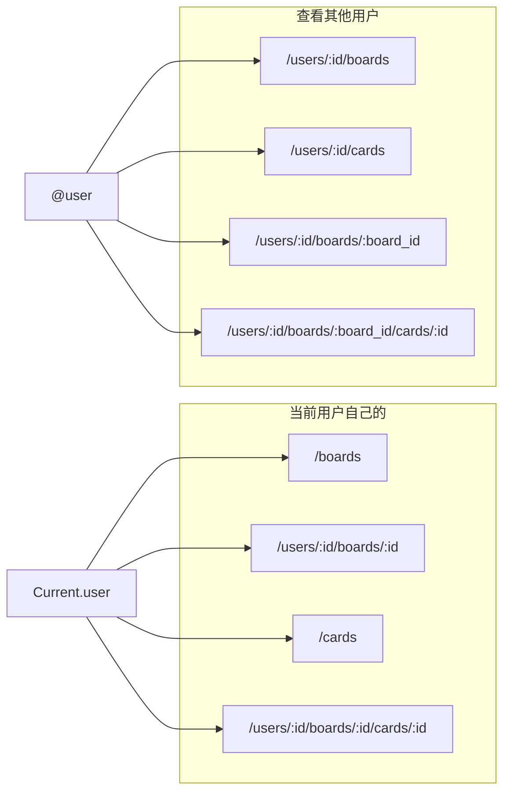

# 看板与卡片路由

「当前用户自己的看板/卡片」与「查看其他用户的看板/卡片」两套路由的数据范围与入口。公开链接（/public/boards）已移除，仅认证用户。路由见 `config/routes.rb`。

## 规范 URL：带 user 的路径

看板与卡片的**规范 URL** 统一为「带 user 的路径」：

- `GET /users/:user_id` — 用户页
- `GET /users/:user_id/boards` — 该用户的看板列表
- `GET /users/:user_id/boards/:board_id` — 看板详情
- `GET /users/:user_id/boards/:board_id/cards/:id` — 卡片详情（`:id` 为卡片 number）

访问上述路径时 `set_account_from_user_path`、`set_context_user` 设置 `Current.account`、`Current.context_user`；`set_board` 按 `params[:user_id]` 从对应用户的 boards 查找。`resolve "Board"` / `"Card"` 统一生成 `user_board_path`、`user_board_card_path` 等带用户前缀的 URL。

**旧路径重定向**：带 `script_name`（账号前缀）的看板/卡片 URL，如 `/:account_slug/boards/:board_id`、`/:account_slug/boards/:board_id/cards/:id`，会 **301** 重定向到上述 `/users/:user_id/boards/...` 规范路径（`user_id` 为看板 `creator`，即 `Board#url_user`）。

## 路由与数据范围总览

## 当前用户 — 自己的看板/卡片

- **看板**：新建 `GET /boards/new`、`POST /boards`；列表 `GET /boards`（`boards_scope` = 单用户时 `Current.account.boards`，否则 `Current.user.boards`；super_admin 时为 account.boards）。详情/编辑/删除使用规范路径 `GET|PATCH|DELETE /users/:user_id/boards/:board_id`（嵌套资源走 `BoardScoped`）。旧路径 `/:account_slug/boards/:id` 会 301 到该规范路径。
- **卡片**：列表 `GET /cards`（FilterScoped，基于 `Current.user.accessible_cards`）。在看板下使用规范路径 `GET|POST|PATCH|DELETE /users/:user_id/boards/:board_id/cards/:id`。列下拖放走 `ColumnScoped`。
- 卡片规范入口仅看板内路径；`/cards/:id`、`/collections/:id/cards/:id` 已移除（404）。可访问看板/卡片定义在 `User::Accessor`（boards through accesses，accessible_cards through boards）。

## 当前用户 — 查看其他用户

- **看板**：`GET /users/:user_id/boards` 展示该用户在当前账号下的看板列表；`GET /users/:user_id/boards/:board_id` 为看板详情（`boards_scope` = 该用户的 boards）。
- **卡片**：`GET /users/:user_id/cards` 重定向到 `GET /cards?assignee_ids=…&creator_ids=…`，即当前用户自己的卡片列表按该用户筛选；无「直接看另一用户完整卡片列表」的独立页。在看板下 `GET /users/:user_id/boards/:board_id/cards/:id` 为卡片详情。

## 小结

| 场景 | 看板入口 | 卡片入口 | 数据范围 |
|------|----------|----------|----------|
| 当前用户自己的看板/卡片 | `/boards`、`/users/:user_id/boards/:board_id` 及嵌套 | `/cards`、`/users/:user_id/boards/:board_id/cards/:id` | 单用户时 account.boards，否则 user.boards / user.accessible_cards |
| 当前用户看其他用户的看板 | `/users/:user_id/boards`、`/users/:user_id/boards/:board_id` | `/users/:user_id/boards/:board_id/cards/:id` | 该用户在当前 account 下的 boards；卡片仍受 Current.user.accessible_cards 限定 |
| 当前用户看其他用户相关卡片 | — | `/users/:user_id/cards` → 重定向到 `/cards?…` | Current.user 的卡片，按 assignee/creator 筛选 |
